## week-1-assignment

Cookie ve Session Storage ile set ve get işlemleri nasıl yapılır ? 

script.js dosyası içerisinde örneklerle açıklayınız.

## Cookie Nedir? 
Cookie (çerez), kullanıcının bilgisayarında web tarayıcılar aracılığıyla saklanan ve en fazla 4KB boyutunda
olan metin (txt) dosyalarıdır. Üyelik sistemi, kullanıcı şifresinin hatırlanması, alışveriş sitelerindeki sepet 
mantığı gibi kullanıcı deneyimini arttıran faaliyetlerde sıklıkla kullanılır.

HTML5’den önce, uygulama verilerinin her sunucu isteğine dahil edilen çerezlerde(cookies) saklanması 
gerekiyordu. Bu yüzden Cookie eski bir istemci tabanlı depolama tekniğidir. Ancak günümüzde, sunucu 
tarafında kullanmaya kıyasla biraz zor gözükse de pratik hale getirilebilir ve sonuç olarak cookie 
oluşturma, silme ve güncelleme gibi işlemler yapılabilmektedir.

### Cookie Oluşturma:
* Javascript’de cookie oluşturma, okuma ve silme işlemleri için **“document.cookie”** özelliği kullanılır. Bu 
özellik, açılan web sayfasında tanımlı bütün çerezleri temsil eder. name = value şeklinde değer girdileri ile 
çalışır.

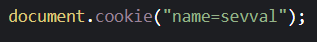

* Oluşturulan çerezlerin süresi varsayılan olarak tarayıcının açık olduğu kadardır. Tarayıcı kapatıldığı anda 
çerezler silinir. Ancak çerezlerin tarayıcı kapandıktan sonra silinmesi istenmiyorsa çerezin ömrünü özellikle 
belirtmemiz gerekir. Belirli bir tarih ve saate kadar çerezin aktif kalması isteniyorsa **“expires"** özelliği 
kullanılırken, belirli bir süre kadar aktif kalması isteniyorsa **“max-age”** özelliğinin kullanılması gerekir.

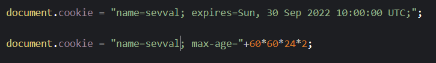

* Oluşturulan çerezin aktifliği için özel bir konum belirtilmezse varsayılan olarak çerezin oluşturulduğu 
sayfanı bulunduğu dizindeki ve bu dizinin alt dizinlerindeki tüm web sayfalarında çerez aktif olacaktır. Yani 
anasayfada oluşturulan bir cookie, web sitesindeki alt domainler hariç olmak üzere bütün sayfalarda 
geçerli olacaktır. Konum belirtmek için **“path”** özelliğini kullanırız. Bu sayede çerezin hangi sayfada
oluşturulduğuna bakılmaksızın tüm sayfalarda geçerli olması sağlanır.

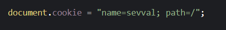

* Oluşturulan çerezler varsayılan olarak, oluşturuldukları alan adındaki sayfalar için etkin durumda 
olacaktır. Çerezin web sitesinin belirli alt alan adlarında da etkili olması için **"domain"** özelliği kullanılır.
Javascript cookie kullanımı sırasında çerez oluşturulurken **“secure”** özelliği tanımlanırsa, çerezin sadece 
HTTPs bağlantısı üzerinden aktarılacağı belirtilmiş olur.

### Cookie Okuma:
* Çerezleri okumak için **getCookie()** kullanılır. Bu fonksiyon parametre olarak çerez adını alır ve o çereze ait 
bilgileri bize getirir.

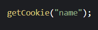

### Cookie Güncelleme:
* Çerezleri güncellemek için aynı isim ve yol değerlerine sahip bir çerez daha oluşturulması gerekir. Aynı 
isme sahip fakat farklı bir yol değeri girilirse, güncelleme işlemi başarısız olacaktır. Aynı zamanda yapılan 
bu hata yeni bir çerez oluşturulmasına sebep olur.

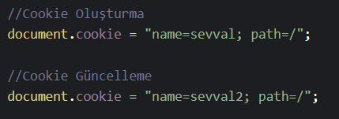

* name adındaki Cookie değerini **setCookie()** fonksiyonu ile de değiştirebiliriz. setCookie() fonksiyonu aynı 
zamanda Cookie oluşturmamızı sağlayan fonksiyondur. Aldığı parametreler sırasıyla Cookie Adı, Cookie 
Değeri ve son olarak tarayıcıda kaç dakika duracağı bilgilerini alır.

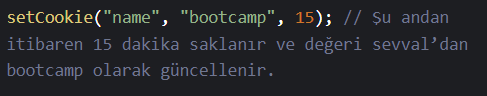

### Cookie Silme:
* Javascript cookie silme işlemi oldukça basittir. Oluşturulan çerezin tarihini geçmiş bir tarih yapmak silme 
işlemi için yeterlidir. Bir diğer yöntem olarak setCookie fonksiyonun tarih değerine **-1** değerini girmemiz
silme işlemi için yeterli olacaktır.

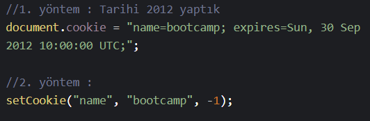

## Session Storage Nedir?
Session Storage mantığı tıpkı çerez gibi çalışmaktadır ancak çerezlere göre daha hızlı ve kullanımı daha 
kolaydır. Ayrıca Cookieler maksimum 4KB olabilirken Session Storage de herhangi bir kısıtlama yoktur. 
Tarayıcı kapanana kadar veya sekme kapanana kadar veriler kaybolmaz. Sekme kapandıktan sonra veriler 
silinir.

### Session Storage Tanımlama:
* Değer tanımlamak için 2 yöntem kullanılır. Birinci yöntem key-value değerini alır. Key, değerin hangi isimle 
depolanacağını belirtir. Value, depolanacak değeri belirtir.

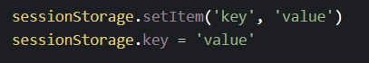

### Session Storage'dan Veri Okuma:
* Session Storage’dan veri okumak için sessionStorage nesnesinin **getItem()** methodu kullanılır.

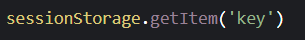

### Session Storage'dan Veri Silme:
* Session Storage'dan veri silmek için sessionStorage nesnesinin **removeItem()** metodu kullanılır.

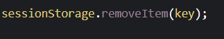

### Session Storage'dan Tüm Verileri Silme:
* Session Storage'daki tüm verileri silmek için sessionStorage nesnesinin **clear()** metodu kullanılır.

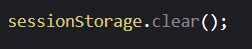